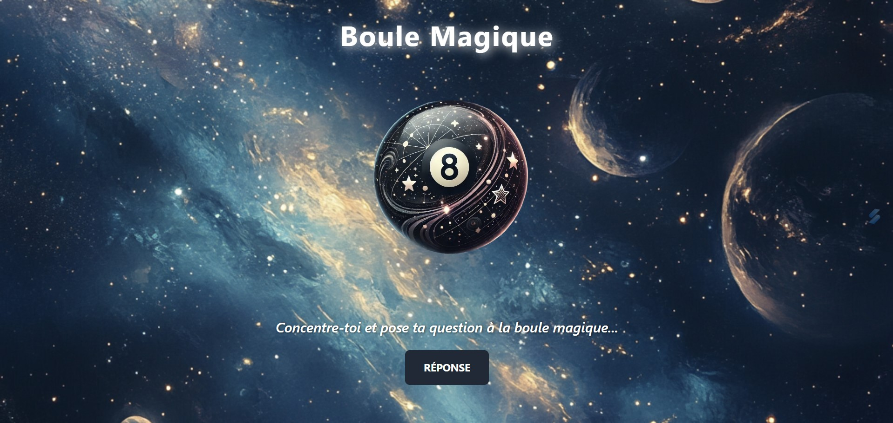
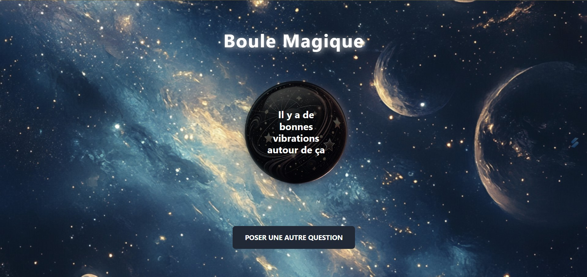
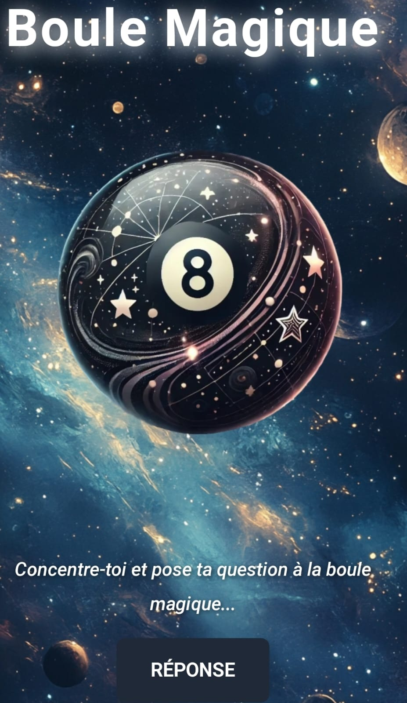
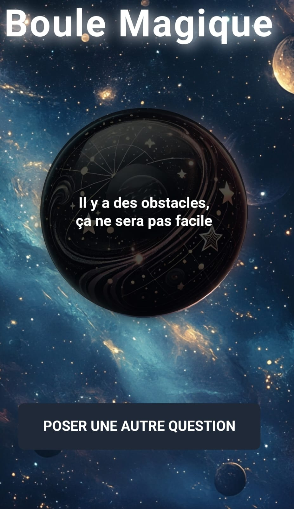

# 🎱 Boule Magique 🎱

 

## 📜 Présentation

Bienvenue dans l'univers mystique de la Boule Magique ! 🧙‍♂️   

Ce projet recrée l'expérience classique de la boule 8 mystique qui répond à toutes tes questions...

 

Que tu cherches des conseils pour une décision importante ou simplement une réponse amusante à une question, cette application est là pour toi ! 
Concentre-toi, pose ta question, et laisse la magie opérer... ✨

 
 

## ✨ Fonctionnalités Principales

🎱 Simulation de boule magique : Pose une question, clique sur le bouton et reçois une réponse mystique parmi 20 possibilités   
💫 Effets visuels dynamiques : Le projet inclut des animations, des effets de retournement, et un design mystique pour une immersion totale   
🖼️ Interface responsive : L'application s'adapte parfaitement à tous les types d'écrans, du mobile à l'ordinateur   
🔄 Rejouabilité : Après chaque réponse, tu peux poser une nouvelle question et redécouvrir l'expérience   

## 📸 Aperçu

Voici à quoi ressemble l'application :   

   

   

   

   

 
 

[Démo vidéo du projet sur ordinateur 🎥](https://www.youtube.com/watch?v=MxrADV5a8GA)

[Démo vidéo du projet sur mobile 🎥](https://www.youtube.com/watch?v=So71LFTBhlQ)

 
 

## 🌐 Lien direct

Pour l'utiliser : [Boule magique 🎱](https://gabriellepagnard.github.io/Boule_magique/
)   

 
 

## 🔧 Technologies Utilisées

⚙️ HTML5 : Structure de l'application   
🎨 CSS3 & TailwindCSS : Styles, animations et design responsive    
💻 JavaScript (ES6+) : Logique de l'application, interactions et dynamique de la boule

 
 

## 📂 Fichiers du Projet

- index.html : Structure principale de l'application   
- style.css : Styles personnalisés pour l'apparence mystique   
- app.js : Logique et interactions JavaScript pour l'expérience magique   
- ressources/ : Dossier contenant les images de la boule et de l'arrière-plan   

 
 

## 🛠️ Installation et Utilisation

Pour démarrer avec Lanceur de dés, suivez ces étapes simples :   

➡️ Clonez le Répertoire :   

`git clone https://github.com/ton-utilisateur/boule_magique.git`   

➡️ Accédez au Répertoire :   

`cd boule_magique`   

➡️ Ouvrez le Fichier "index.html" dans votre navigateur pour voir l'application en action   

➡️ Personnalisez le Code selon vos besoins ou apportez des contributions !   

 
 

## 🏗️ Comment Contribuer

Vous souhaitez contribuer ? 🎉 Voici comment faire :   

### Créer une Branche 🌿

➡️ Pour chaque nouvelle fonctionnalité ou correction, créez une nouvelle branche :   

`git checkout -b nom-de-la-branche`   

### Faire vos Changements ✏️   

Apportez les modifications nécessaires et committez-les :   

`git add .`   
`git commit -m "Description des changements"`   

### Pousser les Changements ⬆️   

Envoyez vos modifications à GitHub 📨 :

`git push origin nom-de-la-branche`   

### Créer une Pull Request 🔄   

Allez sur GitHub, ouvrez une Pull Request et expliquez vos modifications   

 
 

## 🤝 Contributeurs/trices

Gabrielle Pagnard 🧑‍💻 - Créatrice du projet

 
 

## 📬 Contact

Pour toute question ou suggestion, n'hésitez pas à me contacter :   

Email : gpagnard@gmail.com   
GitHub : [GabriellePagnard](https://github.com/GabriellePagnard)     

 
 
 

Merci d'avoir pris le temps de visiter ce projet ! 🙌    

  

Si tu as apprécié l'expérience, n'oublie pas de laisser une ⭐ sur le dépôt GitHub, cela me motive à continuer d'améliorer et de créer des projets encore plus magiques à l'avenir ! 🌟